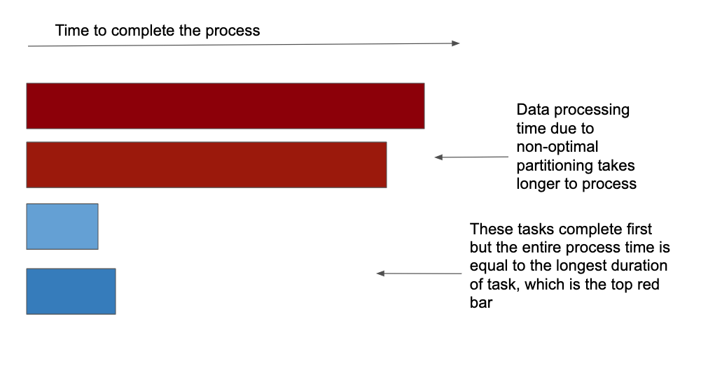
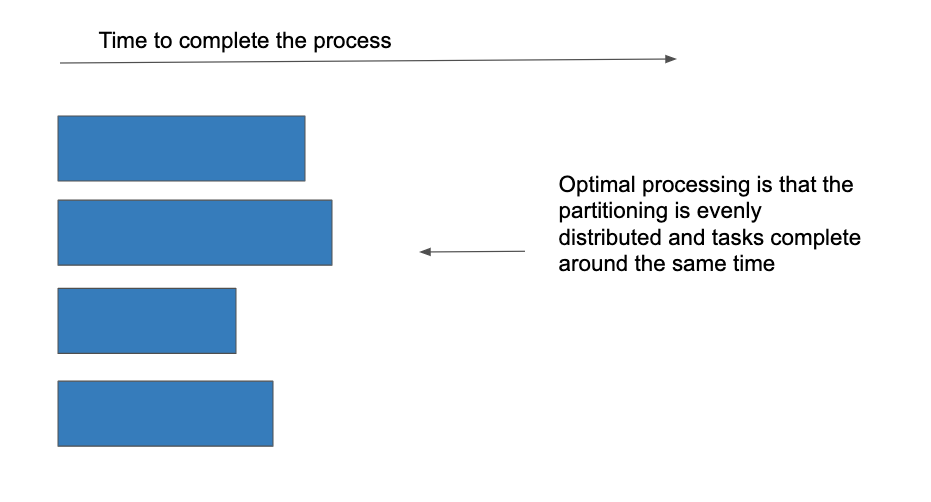
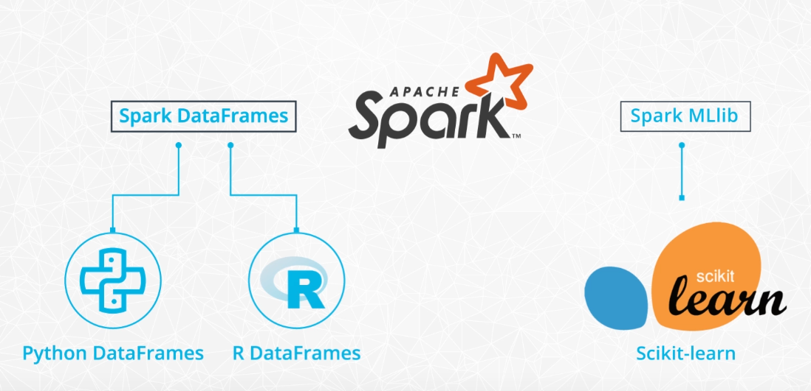
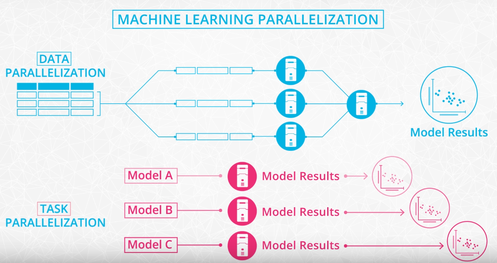

# [Udacity Spark Course](https://www.udacity.com/course/learn-spark-at-udacity--ud2002)

## The Power of Spark
Spark is currently one of the most popular tools for big data analytics. You might have heard of other tools such as Hadoop. Hadoop is a slightly older technology although still in use by some companies. Spark is generally faster than Hadoop, which is why Spark has become more popular over the last few years.


Distributed vs Parallel computing:
- In general, parallel computing implies multiple CPUs share the same memory.
- With distributed computing, each CPU has its own memory.
- In distributed computing, each computer/machine is connected to the other machines across a network.


Hadoop Vocabulary:
- **Hadoop**: an ecosystem of tools for big data storage and data analysis.
- **Hadoop MapReduce**: a system for processing and analysing **large datasets in parallel**. Hadoop is an older system than Spark but is still used by many companies. The major difference between Spark and Hadoop is how they use memory. Hadoop writes intermediate results to disk whereas Spark tries to keep data in memory whenever possible. This makes Spark faster for many use cases.
- **Hadoop Yarn**: a **resource manager** that schedules jobs across a cluster. The manager keeps track of what computer resources to specific tasks.
- **Hadoop Distributed File System (HDFS)**: a big **data storage system** that splits data into chunks and stores the chunks across a cluster of computers.
- **Apache Pig**: a SQL-like language that runs on top of Hadoop MapReduce
- **Apache Hive**: another SQL-like interface that runs on top of Hadoop MapReduce


Spark has a streaming library called Spark Streaming although it is not as popular and fast as some other streaming libraries. Other popular streaming libraries include Storm and Flink.

MapReduce:
- **MapReduce** is a programming technique for manipulating large data sets. "Hadoop MapReduce" is a specific implementation of this programming technique. The technique works by first dividing up a large dataset and distributing the data across a cluster. 
    - In the **map** step, each data is analyzed and converted into a (key, value) pair. 
    - Then these key-value pairs are **shuffled** across the cluster so that all keys are on the same machine. 
    - In the **reduce** step, the values with the same keys are combined together.


## Data Wrangling with Spark
The Spark DAG:


To get Spark to actually run the `map` step, you need to use an "action". One available action is the `collect` method. The `collect()` method takes the results from all of the clusters and "collects" them into a single list on the master node.
```python
from pyspark import SparkContext
sc = SparkContext(appName="maps_and_lazy_evaluation_example")

log_of_songs = [
    "Despacito",
    "Nice for what",
    "No tears left to cry",
    "Despacito",
    "Havana",
    "In my feelings",
    "Nice for what",
    "despacito",
    "All the stars"
]

# parallelize the log_of_songs to use with Spark
distributed_song_log = sc.parallelize(log_of_songs)

distributed_song_log.map(lambda x: x.lower()).collect()
```

HDFS:


The first component of a Spark program is a Spark Context, which is the main entry point of the Spark functionality and connects the cluster with the application.

**General functions**:
- `select()`: returns a new DataFrame with the selected columns.
- `filter()` & `where()`: filters rows using the given condition.
- `groupBy()`: groups the DataFrame using the specified columns, so we can run aggregation on them.
- `sort()`: returns a new DataFrame sorted by the specified column(s). By default, `ascending=True`.
- `dropDuplicates()`: returns a new DataFrame with unique rows based on all or just a subset of columns.
- `withColumn()`: returns a new DataFrame by adding a column or replacing the existing column that has the same name.

**Aggregate functions** include `count()`, `countDistinct()`, `avg()`, `max()`, `min()`, etc. in the `pyspark.sql.functions` module. These methods are not the same as the built-in methods in the Python Standard Library. Hence, you need to be careful not to use them interchangeably.

**User defined functions (UDF)**: In Spark SQL, we can define our own functions with the `udf` method from the `pyspark.sql.functions` module. The default type of the returned variable for UDFs is string. If we would like to return an other type we need to explicitly do so by using the different types from the `pyspark.sql.types` module.

**Window functions** are a way of combining the values of ranges of rows in a DataFrame. When defining the window we can choose how to sort and group (with the `partitionBy` method) the rows and how wide of a window we'd like to use (described by `rangeBetween` or `rowsBetween`). 

**RDDs** are a low-level abstraction of the data. In the first version of Spark, you worked directly with RDDs. You can think of RDDs as long lists distributed across various machines. You can still use RDDs as part of your Spark code although data frames and SQL are easier. 


## Setting up Spark Clusters with AWS
Overview of the Set up of a Spark Cluster
- **Amazon S3** will store the dataset.
- We rent a cluster of machines, i.e., our **Spark Cluster**, and iti s located in AWS data centers. We rent these using AWS service called **Elastic Compute Cloud (EC2)**.
- We log in from your local computer to this Spark cluster.
- Upon running our Spark code, the cluster will load the dataset from Amazon S3 into the cluster’s memory distributed across each machine in the cluster.

New terms:
- **Local mode**: You are running a Spark program on your laptop like a single machine.
- **Standalone mode**: You are defining Spark Primary and Secondary to work on your (virtual) machine. You can do this on EMR or your machine. Standalone mode uses a resource manager like YARN or Mesos.


Create EMR cluster from the CLI:
```cli
aws emr create-cluster --name <cluster_name> \
--use-default-roles --release-label emr-5.28.0  \
--instance-count 3 --applications Name=Spark Name=Zeppelin  \
--bootstrap-actions Path="s3://bootstrap.sh" \
--ec2-attributes KeyName=<Key-pair-file-name>, SubnetId=<subnet-Id> \
--instance-type m5.xlarge --log-uri s3:///emrlogs/
```

Options: 
- ` --name`: You can give any name of your choice. This will show up on your AWS EMR UI.
- `--release-label`: This is the version of EMR you’d like to use.
- `--instance-count`: Annotates instance count. One is for the primary, and the rest are for the secondary. For example, if `--instance-count` is given 4, then 1 instance will be reserved for primary, then 3 will be reserved for secondary instances.
- `--applications`: List of applications you want to pre-install on your EMR at the launch time
- `--bootstrap-actions`: The Path attribute provides the path to a file (residing in S3 or locally) that contains a script that runs during a bootstrap action. The script may set environmental variables in all the instances of the cluster. This file must be accessible to each instance in the cluster.
- `--ec2-attributes`: The KeyName field specifies your key-pair file name, for example, if it is MyKey.pem, just specify MyKey for this field. There is one more field that you should specify, SubnetId. The aws documentation says that the cluster must be launched within an EC2-VPC. Therefore, you need to provide the VPC subnet Id in which to create the cluster. If you do not specify this value, the cluster is launched in the normal AWS cloud, outside of any VPC. Go to the VPC service in the web console to copy any of the subnet IDs within the default VPC. If you do not see a default VPC in your account, use a simple command to create a default VPC: `aws ec2 create-default-vpc --profile <profile-name>`
- `--instance-type`: Specify the type of instances you want to use. Detailed list can be accessed here, but find the one that can fit your data and your budget.
- `--log-uri`: S3 location to store your EMR logs in. This log can store EMR metrics and also the metrics/logs for submission of your code.


While the use of Jupyter Notebook is common across the industry, you can explore using Zeppelin notebooks. Zeppelin notebooks have been available since EMR 5.x versions, and they have **direct access to Spark Context**, such as a local spark-shell. For example, if you type `sc`, you’ll be able to get Spark Context within Zeppelin notebooks.

Submitting Spark Script Instructions: `spark-submit <filename>.py`

Data engineers always save their initial, final, and intermediate data of the data pipeline in the S3 for future retrieval. It is best practice to move your files from your local machine to AWS S3, then use the program to read the data from AWS S3.

The letter change on the URI scheme makes a big difference because it causes different software to be used to interface to S3. [Difference](https://stackoverflow.com/questions/33356041/technically-what-is-the-difference-between-s3n-s3a-and-s3) between `s3`, `s3n` and `s3a`:
- The difference between `s3` and `s3n`/`s3a` is that `s3` is a block-based overlay on top of Amazon S3, while `s3n`/`s3a` are not (they are object-based).
- The difference between `s3n` and `s3a` is that `s3n` supports objects up to 5GB in size, while `s3a` supports objects up to 5TB and has higher performance (both are because it uses multi-part upload). `s3a` is the successor to `s3n`.

Differences between HDFS and AWS S3:
- **AWS S3 is an object storage system** that stores the data using key value pairs, namely bucket and key, and **HDFS is an actual distributed file system** which guarantees fault tolerance. HDFS achieves fault tolerance by having duplicate factors, which means it will duplicate the same files at 3 different nodes across the cluster by default (it can be configured to different numbers of duplication).
- HDFS has usually been **installed in on-premise systems**, and traditionally have had engineers on-site to maintain and troubleshoot Hadoop Ecosystem, which **cost more than having data on cloud**. Due to the **flexibility of location** and **reduced cost of maintenance**, cloud solutions have been more popular. With extensive services you can use within AWS, S3 has been a more popular choice than HDFS.
- Since **AWS S3 is a binary object store**, it can **store all kinds of format**, even images and videos. HDFS will strictly require a certain file format - the popular choices are **avro** and **parquet**, which have relatively high compression rate and which makes it useful to store large dataset.

## Debugging and Optimisation
Debugging Spark is harder on Standalone mode:
- Previously, we ran Spark codes in the local mode where you can easily fix the code on your laptop because you can view the error in your code on your local machine.
- For Standalone mode, the cluster (group of manager and executor) load data, distribute the tasks among them and the executor executes the code. The result is either a successful output or a log of the errors. The logs are captured in a separate machine than the executor, which makes it important to interpret the syntax of the logs - this can get tricky.
- One other thing that makes the standalone mode difficult to deploy the code is that your laptop environment will be **completely different than AWS EMR** or other cloud systems. As a result, you will always have to test your code rigorously on different environment settings to make sure the code works.

**Accumulators** are variables that accumulate. Because Spark runs in distributed mode, the workers are running in parallel, but asynchronously. For example, worker 1 will not be able to know how far worker 2 and worker 3 are done with their tasks. With the same analogy, the variables that are local to workers are not going to be shared to another worker unless you accumulate them. Accumulators are used for mostly sum operations, like in Hadoop MapReduce, but you can implement it to do otherwise.

**Broadcast variables** in Apache Spark is a mechanism for sharing variables across executors that are meant to be read-only. Without broadcast variables these variables would be shipped to each executor for every transformation and action, and this can cause network overhead. However, with broadcast variables, they are shipped once to all executors and are cached for future reference. [MORE INFO HERE](https://www.edureka.co/blog/broadcast-variables/)
- Broadcast join is a way of joining a large table and small table in Spark.
- Broadcast join is like a map-side join in MapReduce.

Broadcast Variables Use case: Imagine that while doing a transformation we need to lookup a large table of zip codes/pin codes. Here, it is neither feasible to send the large lookup table every time to the executors, nor can we query the database every time. The solution should be to convert this lookup table to a broadcast variables and Spark will cache it in every executor for future reference.
```python

from pyspark import SparkContext

sc = SparkContext('local[*]', 'pyspark')

my_dict = {"item1": 1, "item2": 2, "item3": 3, "item4": 4} 
my_list = ["item1", "item2", "item3", "item4"]

my_dict_bc = sc.broadcast(my_dict)

def my_func(letter):
    return my_dict_bc.value[letter] 

my_list_rdd = sc.parallelize(my_list)

result = my_list_rdd.map(lambda x: my_func(x)).collect()

print(result)
```

There are two types of functions in Spark: **transformations** and **actions**. Spark uses lazy evaluation to evaluate RDD and dataframe. Lazy evaluation means the code is not executed until it is needed. This is significant because you can **chain your RDD or dataframe as much as you want**, but it might not do anything until you actually **trigger** with some **action words**. And if you have lengthy transformations, then it might take your executors quite some time to complete all the tasks.

Setting Log Level in the Spark Context:
```python
spark.sparkContext.setLogLevel("ERROR") # only error messages
spark.sparkContext.setLogLevel("INFO") # more verbose messages
```

In the real world, you’ll see a lot of cases where the data is skewed. **Skewed data** means due to **non-optimal partitioning**, the data is heavy on few partitions. This could be problematic. Imagine you’re processing this dataset, and the data is distributed through your cluster by partition. In this case, only a few partitions will continue to work, while the rest of the partitions do not work. If you were to run your cluster like this, you will get billed by the time of the data processing, which means you will get billed for the duration of the longest partitions working. This isn’t optimized, so we would like to re-distribute the data in a way so that all the partitions are working.

|non-optimal partitioning with skewed data|optimal partitioning with skewed data|
|:-:|:-:|
|||

In order to look at the skewness of the data:
- Check for MIN, MAX and data RANGES
- Examine how the workers are working
- Identify workers that are running longer and aim to optimize it.

Solutions to skewed data problems:
- Use Alternate Columns that are more normally distributed.
- Make Composite Keys: For instance, you can make composite keys by combining two columns so that the new column can be used as a composite key. 
- Partition by number of Spark workers: Another easy way is using the Spark workers. If you know the number of your workers for Spark, then you can easily partition the data by the number of workers `df.repartition(number_of_workers)` to repartition your data evenly across your workers. For example, if you have 8 workers, then you should do `df.repartition(8)` before doing any operations.

## Machine Learning with Spark
Spark supports two machine learning libraries `spark.ml` and `spark.mllib`. Both libraries are part of Spark's Machine Learning Library known as MLlib.


