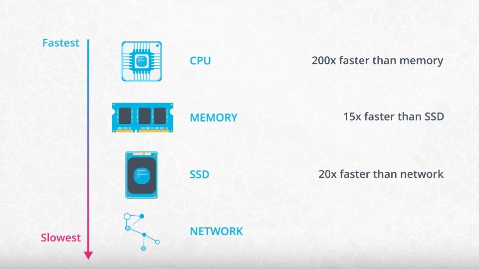
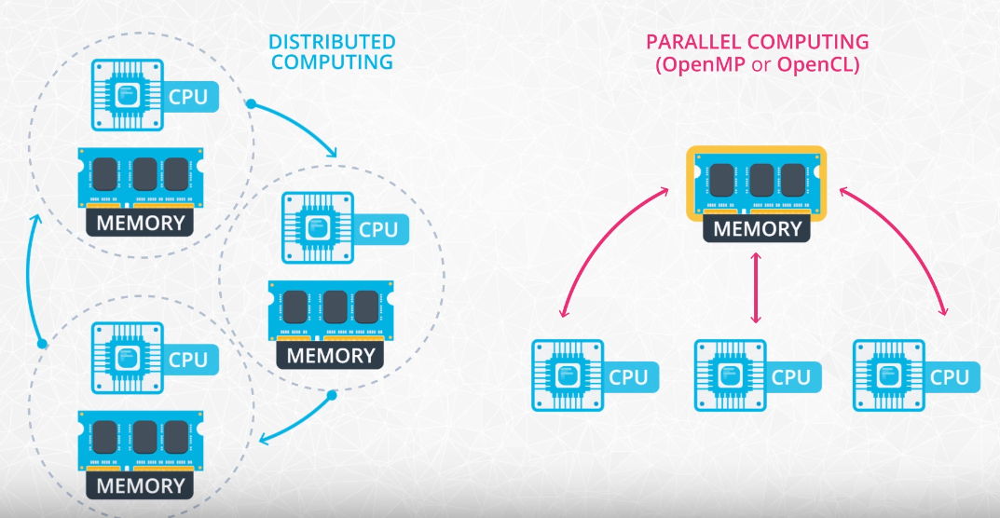
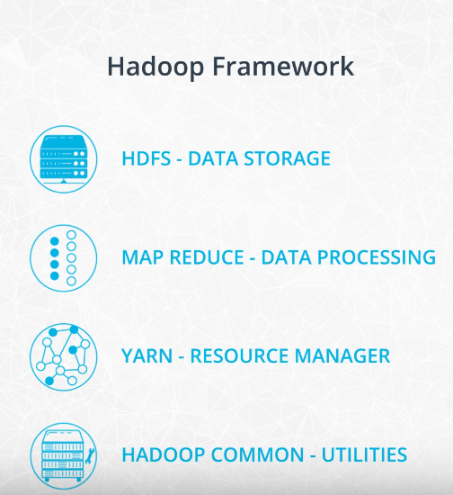
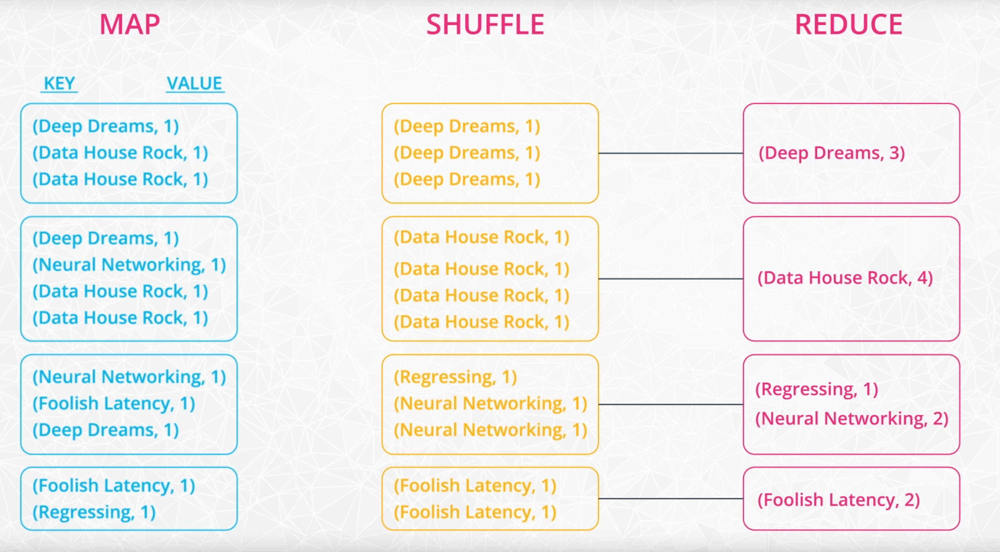
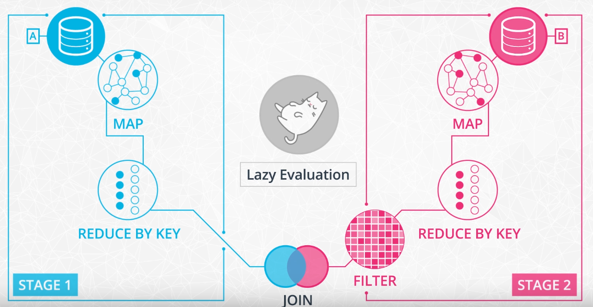
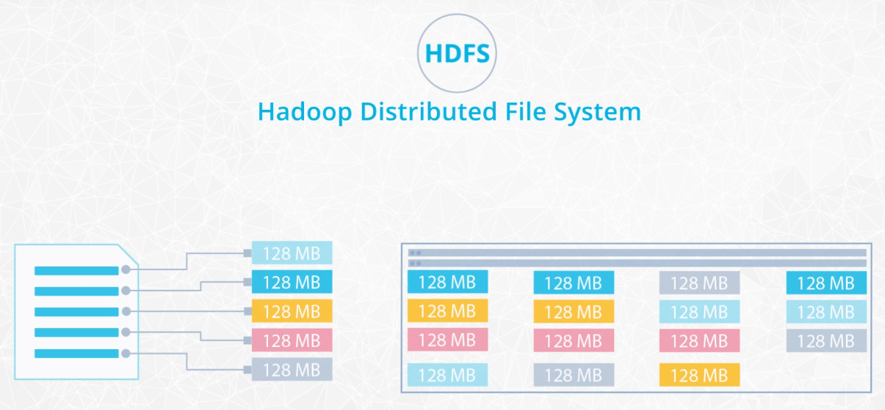
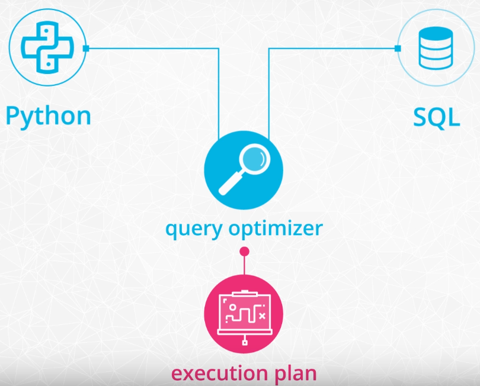
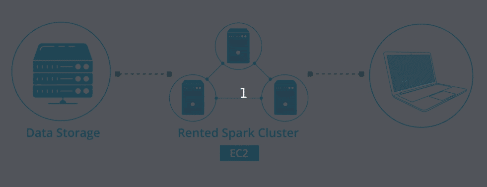

# [Udacity Spark Course](https://www.udacity.com/course/learn-spark-at-udacity--ud2002)

## The Power of Spark
Spark is currently one of the most popular tools for big data analytics. You might have heard of other tools such as Hadoop. Hadoop is a slightly older technology although still in use by some companies. Spark is generally faster than Hadoop, which is why Spark has become more popular over the last few years.



Distributed vs Parallel computing:
- In general, parallel computing implies multiple CPUs share the same memory.
- With distributed computing, each CPU has its own memory.
- In distributed computing, each computer/machine is connected to the other machines across a network.



Hadoop Vocabulary:
- **Hadoop**: an ecosystem of tools for big data storage and data analysis.
- **Hadoop MapReduce**: a system for processing and analysing **large datasets in parallel**. Hadoop is an older system than Spark but is still used by many companies. The major difference between Spark and Hadoop is how they use memory. Hadoop writes intermediate results to disk whereas Spark tries to keep data in memory whenever possible. This makes Spark faster for many use cases.
- **Hadoop Yarn**: a **resource manager** that schedules jobs across a cluster. The manager keeps track of what computer resources to specific tasks.
- **Hadoop Distributed File System (HDFS)**: a big **data storage system** that splits data into chunks and stores the chunks across a cluster of computers.
- **Apache Pig**: a SQL-like language that runs on top of Hadoop MapReduce
- **Apache Hive**: another SQL-like interface that runs on top of Hadoop MapReduce



Spark has a streaming library called Spark Streaming although it is not as popular and fast as some other streaming libraries. Other popular streaming libraries include Storm and Flink.

MapReduce:
- **MapReduce** is a programming technique for manipulating large data sets. "Hadoop MapReduce" is a specific implementation of this programming technique. The technique works by first dividing up a large dataset and distributing the data across a cluster. 
    - In the **map** step, each data is analyzed and converted into a (key, value) pair. 
    - Then these key-value pairs are **shuffled** across the cluster so that all keys are on the same machine. 
    - In the **reduce** step, the values with the same keys are combined together.



## Data Wrangling with Spark
The Spark DAG:



To get Spark to actually run the `map` step, you need to use an "action". One available action is the `collect` method. The `collect()` method takes the results from all of the clusters and "collects" them into a single list on the master node.
```python
from pyspark import SparkContext
sc = SparkContext(appName="maps_and_lazy_evaluation_example")

log_of_songs = [
    "Despacito",
    "Nice for what",
    "No tears left to cry",
    "Despacito",
    "Havana",
    "In my feelings",
    "Nice for what",
    "despacito",
    "All the stars"
]

# parallelize the log_of_songs to use with Spark
distributed_song_log = sc.parallelize(log_of_songs)

distributed_song_log.map(lambda x: x.lower()).collect()
```

HDFS:



The first component of a Spark program is a Spark Context, which is the main entry point of the Spark functionality and connects the cluster with the application.

**General functions**:
- `select()`: returns a new DataFrame with the selected columns.
- `filter()` & `where()`: filters rows using the given condition.
- `groupBy()`: groups the DataFrame using the specified columns, so we can run aggregation on them.
- `sort()`: returns a new DataFrame sorted by the specified column(s). By default, `ascending=True`.
- `dropDuplicates()`: returns a new DataFrame with unique rows based on all or just a subset of columns.
- `withColumn()`: returns a new DataFrame by adding a column or replacing the existing column that has the same name.

**Aggregate functions** include `count()`, `countDistinct()`, `avg()`, `max()`, `min()`, etc. in the `pyspark.sql.functions` module. These methods are not the same as the built-in methods in the Python Standard Library. Hence, you need to be careful not to use them interchangeably.

**User defined functions (UDF)**: In Spark SQL, we can define our own functions with the `udf` method from the `pyspark.sql.functions` module. The default type of the returned variable for UDFs is string. If we would like to return an other type we need to explicitly do so by using the different types from the `pyspark.sql.types` module.

**Window functions** are a way of combining the values of ranges of rows in a DataFrame. When defining the window we can choose how to sort and group (with the `partitionBy` method) the rows and how wide of a window we'd like to use (described by `rangeBetween` or `rowsBetween`). 

**RDDs** are a low-level abstraction of the data. In the first version of Spark, you worked directly with RDDs. You can think of RDDs as long lists distributed across various machines. You can still use RDDs as part of your Spark code although data frames and SQL are easier. 



## Setting up Spark Clusters with AWS
Overview of the Set up of a Spark Cluster
- **Amazon S3** will store the dataset.
- We rent a cluster of machines, i.e., our **Spark Cluster**, and iti s located in AWS data centers. We rent these using AWS service called **Elastic Compute Cloud (EC2)**.
- We log in from your local computer to this Spark cluster.
- Upon running our Spark code, the cluster will load the dataset from Amazon S3 into the cluster’s memory distributed across each machine in the cluster.

New terms:
- **Local mode**: You are running a Spark program on your laptop like a single machine.
- **Standalone mode**: You are defining Spark Primary and Secondary to work on your (virtual) machine. You can do this on EMR or your machine. Standalone mode uses a resource manager like YARN or Mesos.



Create EMR cluster from the CLI:
```cli
aws emr create-cluster --name <cluster_name> \
--use-default-roles --release-label emr-5.28.0  \
--instance-count 3 --applications Name=Spark Name=Zeppelin  \
--bootstrap-actions Path="s3://bootstrap.sh" \
--ec2-attributes KeyName=<Key-pair-file-name>, SubnetId=<subnet-Id> \
--instance-type m5.xlarge --log-uri s3:///emrlogs/
```

Options: 
- ` --name`: You can give any name of your choice. This will show up on your AWS EMR UI.
- `--release-label`: This is the version of EMR you’d like to use.
- `--instance-count`: Annotates instance count. One is for the primary, and the rest are for the secondary. For example, if `--instance-count` is given 4, then 1 instance will be reserved for primary, then 3 will be reserved for secondary instances.
- `--applications`: List of applications you want to pre-install on your EMR at the launch time
- `--bootstrap-actions`: The Path attribute provides the path to a file (residing in S3 or locally) that contains a script that runs during a bootstrap action. The script may set environmental variables in all the instances of the cluster. This file must be accessible to each instance in the cluster.
- `--ec2-attributes`: The KeyName field specifies your key-pair file name, for example, if it is MyKey.pem, just specify MyKey for this field. There is one more field that you should specify, SubnetId. The aws documentation says that the cluster must be launched within an EC2-VPC. Therefore, you need to provide the VPC subnet Id in which to create the cluster. If you do not specify this value, the cluster is launched in the normal AWS cloud, outside of any VPC. Go to the VPC service in the web console to copy any of the subnet IDs within the default VPC. If you do not see a default VPC in your account, use a simple command to create a default VPC: `aws ec2 create-default-vpc --profile <profile-name>`
- `--instance-type`: Specify the type of instances you want to use. Detailed list can be accessed here, but find the one that can fit your data and your budget.
- `--log-uri`: S3 location to store your EMR logs in. This log can store EMR metrics and also the metrics/logs for submission of your code.


## Debugging and Optimisation
## Machine Learning with Spark